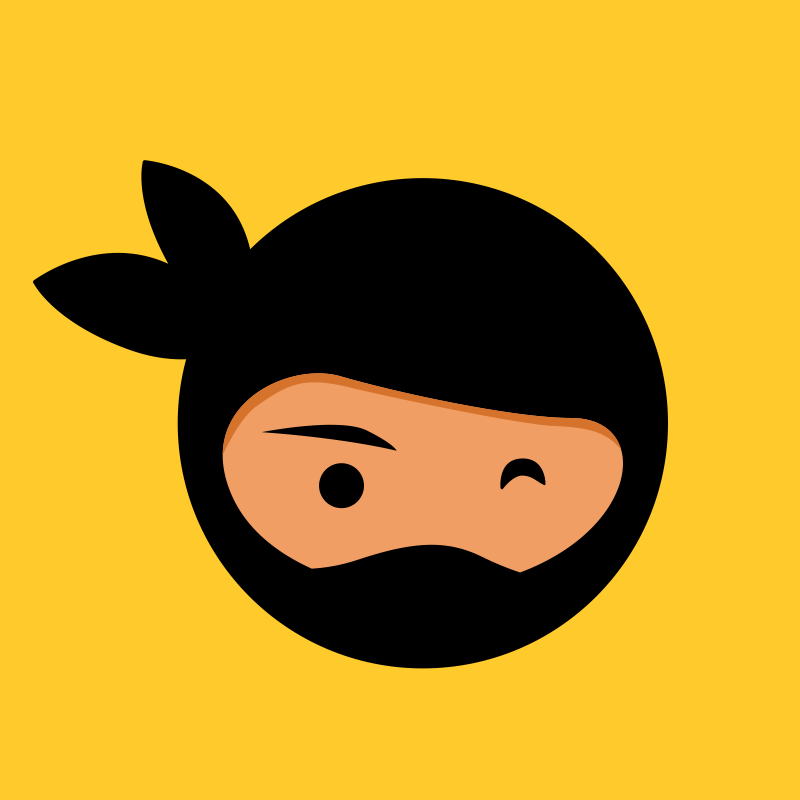
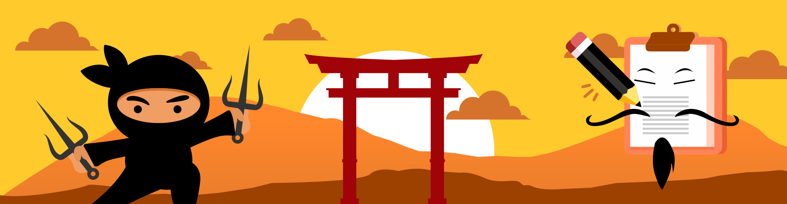

<h1>Hackathon - newtab academy</h1>
<h2>Ninja List</h2>
<h3>O melhor App para lista de compras</h3>

  

O aplicativo Ninja List irá te ajudar na hora de lembrar ou adicionar produtos na lista de compras, você inclusive poderá ver com mais detalhes o dia / semana / mês / ano de cada lista de compras.

<h3><strong>Tecnologias Utilizadas</strong></h3>

<table>
  <tr>
    <td>
      
    </td>
    <td>
      
    </td>
    <td>
      
    </td>
     <td>
      
    </td>
     <td>
      
    </td>
    <td>
      
    </td>
    <td>
      
    </td>
    <td>
      
    </td> 
</table>

<h3><strong>Ferramentas Utilizadas</strong></h3>

<table>
  <tr>
    <td>
      
    </td>
    <td>
      
    </td>
    <td>
      
    </td>
    <td>
      
    </td>
    <td>
      
    </td>
    <td>
      
    </td>
  </tr>
</table>

<h3><strong>Site do Projeto</strong></h3>
<a href="https://hackathon-ninjalist.netlify.app/" target="_blank">https://hackathon-ninjalist.netlify.app/</a>

 

  

<h3><strong>Integrantes do Projeto</strong></h3>

<table align='center'>
 <tr>
    <td>
      
      
Edison Junior

    </td>
    <td>
      
      
Edivaldo Reis

    </td>
  </tr>
</table>

  

